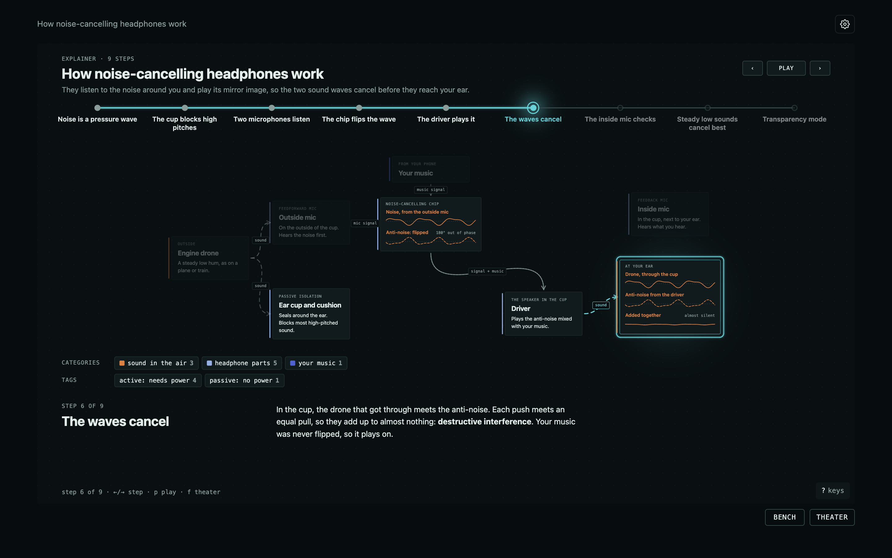
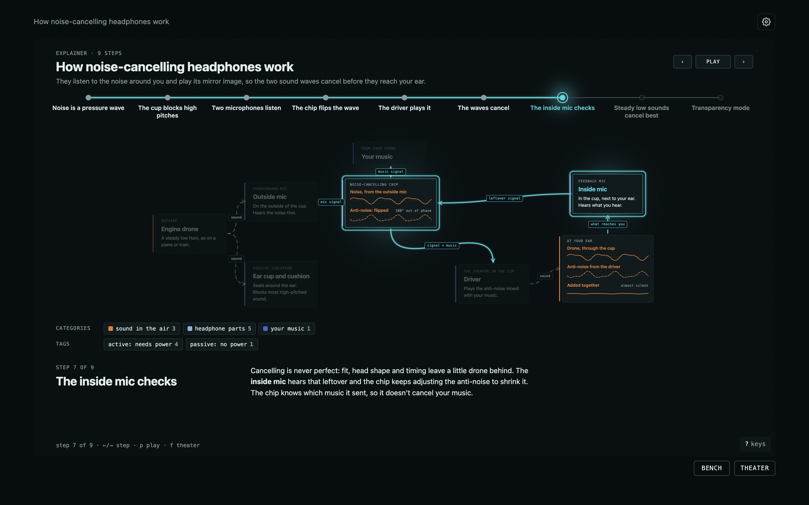
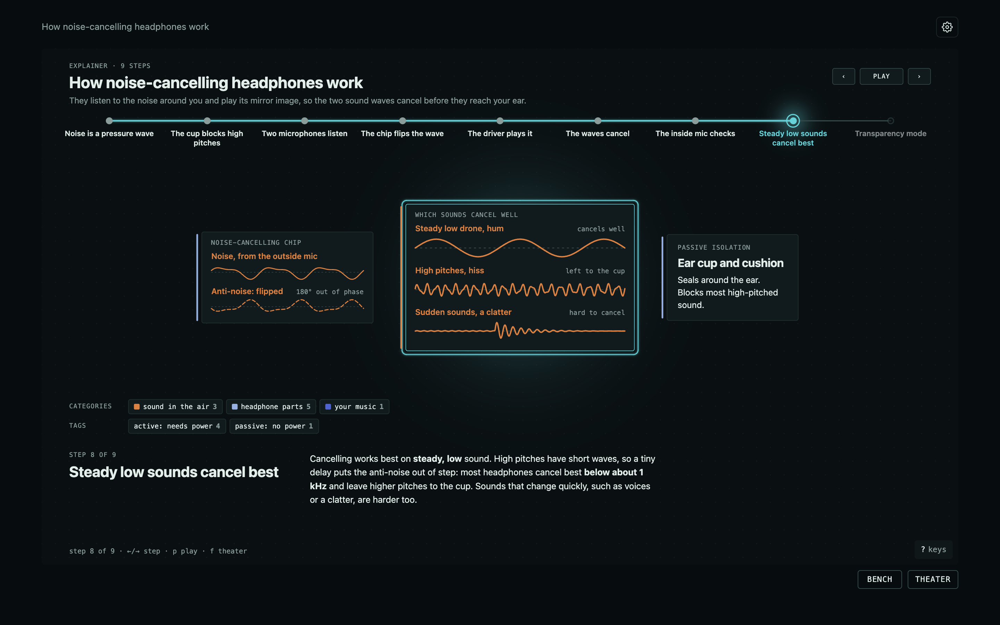
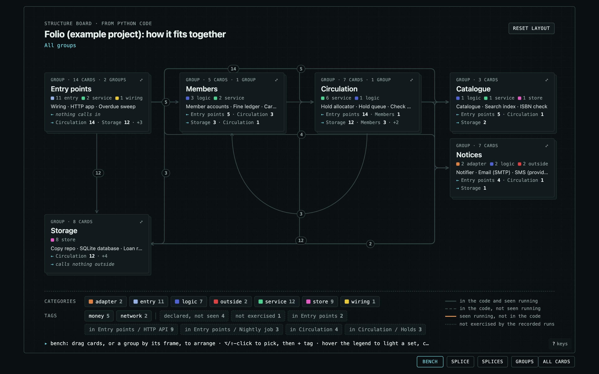
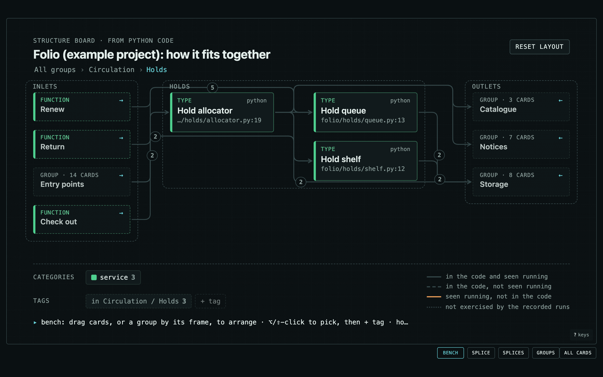
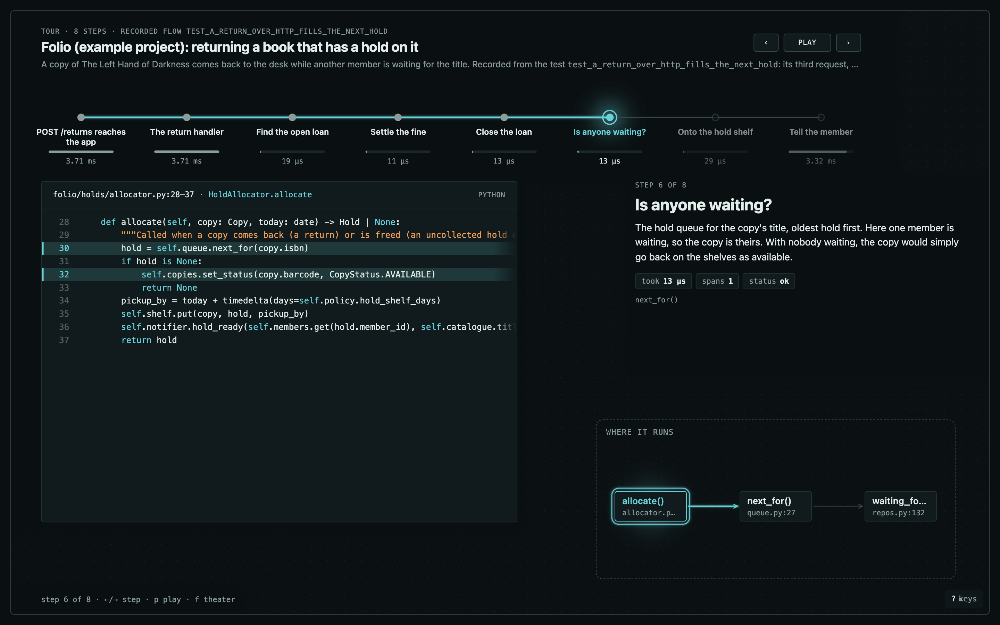
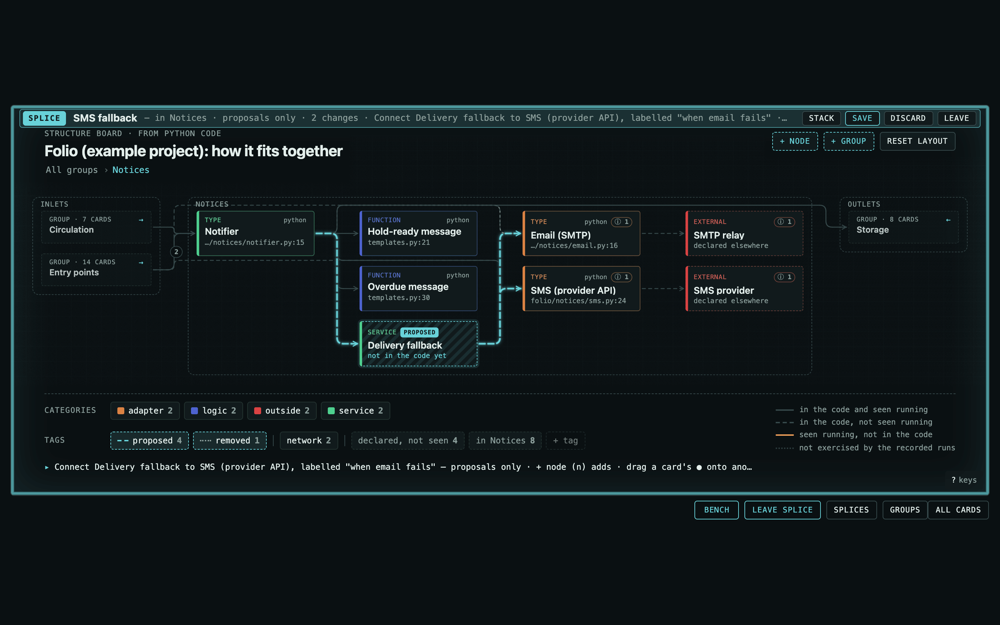

# Karyo

*Karyo* (from *karyotype*) is part of the Adenine dev-tooling family. One figure is a **plate**.

Karyo makes visual documentation: step-by-step explainers of any topic, and live views of a project drawn from a model that its own code describes.

Plates are built from **real HTML elements** — cards, code blocks, text, chips — plus a **three.js fx layer** for wires, self-drawing outlines, comets, soft light and 3D. Every frame is a pure function of time, so a plate can be scrubbed, stepped, looped, screenshotted or exported to video, and it always shows the same frame.

Text stays text: selectable, searchable, styled by CSS, readable by screen readers, and themeable with CSS custom properties.

## What it looks like

**Explaining a concept, no code involved.** A step-through explainer of how noise-cancelling headphones work: each step brings in or moves only the parts it talks about, and every claim in it was checked against published sources.

<picture><source media="(prefers-color-scheme: light)" srcset="docs/images/readme/explainer-cancel-light.png"></picture>

<table><tr>
<td width="50%"><br><sub>The real signal path, with the inside mic correcting what's left.</sub></td>
<td width="50%"><br><sub>Why steady low sounds cancel best.</sub></td>
</tr></table>

**Documenting a codebase.** Folio, an example project made for this README: a library-lending service in Python (catalogue, members, loans, holds, fines, notices), adopted with `karyo init`: automatic mode reads the code, three `# karyo:` comments add meaning where it helps, a recorded test run marks what actually ran, and a curation file groups it. No card was placed by hand.

<picture><source media="(prefers-color-scheme: light)" srcset="docs/images/readme/project-overview-light.png"></picture>

<table><tr>
<td width="33%"><br><sub>Inside a group: what calls in, what it calls out to.</sub></td>
<td width="33%"><br><sub>A tour of a recorded run: real source, real timings.</sub></td>
<td width="33%"><br><sub>Splice: a what-if (an SMS fallback) drawn over the real code.</sub></td>
</tr></table>

## Install (Claude Code plugin)

Karyo ships as one Claude Code plugin, `karyo`, in the `adenine` marketplace. Two commands, and it works in any project:

```sh
claude plugin marketplace add adenineio/adenine
claude plugin install karyo@adenine
```

(In a session: `/plugin marketplace add adenineio/adenine`, `/plugin install karyo@adenine`, then `/reload-plugins`.) It needs [bun](https://bun.sh), plus [uv](https://docs.astral.sh/uv/) for the MCP server and Jarvis, and Google Chrome for stills. Then, in any project:

- `karyo view` (or `/karyo:view`) serves the project's Karyo view on a free local port and prints the URL: its model as a structure board (Bench, theater, Splice), recorded flows, tours and explainers. `karyo model scan` turns `# karyo:` directives into the model it draws.
- **"Set up Karyo here"**: the `karyo-adopt` skill runs `karyo init` (a plan you approve: a launcher, `.gitignore` entries, `karyo-*` recipes in an existing justfile or Makefile, an optional refresh hook and CI job), scans the code with no annotations, proposes a curation (`karyo/curation.json`), records the tests once and opens the board; later it keeps the curation in step with refactors. `karyo init --remove` takes it all out. The whole story: [`docs/ADOPT.md`](docs/ADOPT.md).
- The skills `karyo-explain` (visual explainers of anything) and `docket` (decisions and come-back-tos) trigger on their own; `/karyo:jarvis` starts Jarvis mode.
- The `karyo` MCP server and the `karyo` CLI are there too. `karyo setup` checks the tools and installs Karyo's dependencies into the plugin's data dir, never into your project.

**Try the demo:** run `/karyo:demo` (or `karyo demo claude-code`). It builds "Claude Code, explained", a series of 21 explainers, and opens its map in your browser.

Requirements, what the plugin contains, where it keeps its files, and updates: [`docs/PACKAGING.md`](docs/PACKAGING.md).

## Quick start (this repo)

```sh
bun install
bunx vite            # http://localhost:5180 — every scene, with the ⚙ theme menu
```

Every command lives in the `justfile`: `just --list` shows them (`just install`, `just dev`, `just stills <scene> <t>`, `just test`, …).

`?scene=request-flow` shows one scene; `&t=3.2` opens it paused; `&theme=adenine-jade`; `&mode=dark`.

## Scenes included

| id | shows |
|---|---|
| `request-flow` | prompt typed into a card, spark to the model, token probabilities, answer streamed word by word |
| `ci-pipeline` | job graph with elbow wires, live status text and progress bars, fan-out / fan-in |
| `code-walkthrough` | a real `<pre>` stepped line by line; tokens in the code outlined and wired to callouts; live trace values |
| `network-stack` | HTML cards in 3D (CSS3DRenderer): a flat diagram tilts into an exploded view while a packet gains headers |
| `layers-stack` | a Stack view: one page load seen at four network layers (HTTP, TLS, TCP, IP), the same cast in every slice, the legend showing what each layer adds or loses |

## Code that draws itself

Karyo can also draw a project from a **model file the code produces**: Python and Go SDKs record declared structure (annotations), extracted structure (imports) and observed behaviour (traced runs, joined across processes and languages), and Swift projects are described by `// karyo:` comment markers. A merge step reconciles them into warnings, and generic views draw any model with no hand layout. See [`docs/MODEL.md`](docs/MODEL.md), and `karyo view` (or `just view <dir>`) to open a project's model.

| view | shows |
|---|---|
| structure map | the model's components in their groups, file:line refs, wires styled by source (declared, imported, observed), mismatches flagged as badges |
| flow replay | one recorded run replayed across processes and languages, the live call stack lit, real durations as a timeline |
| structure board | the map as an interactive board: open a card for its details, rearrange it (Bench), propose changes in a sandbox (Splice) |
| trace board | a recorded flow to step through: its root calls as cards beside the map; selecting one unfolds its nested calls and lights its path |
| tour | a recorded run as stations with real durations: each step's source, prose and a mini diagram of the nodes involved |
| Stack view | ordered slices of models (commits, layers, lanes) stacked in depth, the legend showing what changes between them |

## Explainers and Claude

Karyo also makes explainers of **any topic**: a JSON spec (`*.explainer.json`) of components, links and steps, validated, previewed as stills and shipped as one self-contained HTML file. The format is in [`docs/EXPLAINERS.md`](docs/EXPLAINERS.md). Three ways in, all running the same engine:

- **The `karyo` CLI** (`cli/karyo.ts`, bun). It works from any directory. `karyo new <dir>` starts a spec from a template (`blank`, `steps`, `graph`). `karyo validate` reports issues as JSON pointers with hints. `karyo stills --step all` renders each step at rest to PNG. `karyo lint` finds layout problems, `karyo build` writes one HTML file and `karyo open` opens it. `karyo serve` prints a live dev URL. `karyo components` and `karyo component show|new|check` manage components, and every command takes `--json`. Run `karyo --help` for the full list, or use `just karyo …` inside the repo.
- **The Claude Code skill** `karyo-explain` (`skills/karyo-explain/SKILL.md`, in the plugin) triggers when you ask Claude to explain or visualize something. It follows a set loop: plan the steps, write the spec, validate, render stills and *look* at them, fix what's wrong, lint, build.
- **The MCP server** for Claude Desktop and Cowork (`integrations/mcp/`, Python, stdio). Its tools create, write, validate, preview and build explainers in a workspace (`$KARYO_WORKSPACE`, default `~/.adenine/karyo/explainers`). Previews come back as images, so the model sees its own work. It also has tools to list, show and create components. Setup and the `claude_desktop_config.json` snippet are in [`integrations/mcp/README.md`](integrations/mcp/README.md).

All three come with the plugin (above). From a checkout: `just karyo …`, `just plugin-dev` (Claude Code with this checkout as the plugin for one session), `just mcp-test` (the MCP server's tests).

Custom components are folders of `component.json` + `template.html` + `style.css`. Karyo looks for them in the explainer's own `components/`, then `$KARYO_COMPONENTS`, then `~/.adenine/karyo/components` (shared across projects: `karyo component new <name> --global`), then the built-ins in `components/`.

## The docket

`karyo docket` keeps one sheet per project of what needs you: decisions to make, things to review, and things to come back to before a milestone. It's a plain Markdown file in `~/.adenine/karyo/dockets/`, shared by every worktree and branch of the repo, and you can edit it by hand. Claude Code sessions add to it, and each item records the branch, worktree and session it came from. `karyo docket add "…" --before beta`, `list`, `close D-3 "…"`, `milestones`, `open`, or `just docket …`. The format, storage and CLI are in [`docs/DOCKET.md`](docs/DOCKET.md).

## Rendering

```sh
bun scripts/render.ts stills --scene request-flow --t 1,3,5      # PNGs to look at
bun scripts/render.ts sheet  --scene request-flow --n 12          # contact sheet
bun scripts/render.ts lint                                        # layout problems in every scene
bun scripts/render.ts video  --scene request-flow --out out/rf.mp4   # also .gif / .webm
```

Add `--theme adenine-periwinkle`, `--mode light` or `--mode dark` to check other themes. Needs Google Chrome (or `CHROME_PATH`) and ffmpeg for sheets and video.

## Layout

- `src/engine/` — the engine: `stage.ts` (clock, frame order, player, mounting), `node.ts` (animated HTML elements and their on-screen geometry), `fx.ts` (WebGL lines, background, lights), `geom.ts` (paths, wires), `motifs.ts` (comet, pulses, packets, outlines), `text.ts`, `space3d.ts`, `theme.ts`, `karyo.css` (structure, themes, engine classes), `util.ts` (timing).
- `src/scenes/` — one file per scene, auto-registered.
- `src/model/` — the Karyo model: types, merge + reconcile (`model.ts`), and the generic views that draw any model: map and flow replay (`scenes.ts`), structure board (`board.ts`), trace board (`flowboard.ts`), tour (`tour.ts`), Stack view (`stack.ts`), splices (`splice.ts`).
- `sdk/python/`, `sdk/go/` — the language SDKs (standard library only). `scripts/model.ts` merges fragments.
- `spec/karyo-model.schema.json` — the format's JSON Schema.
- `cli/karyo` → `cli/karyo.ts` — the `karyo` CLI: explainers, the docket, and the plugin runtime (`view`, `jarvis`, `model`, `setup`; `scripts/karyo-runtime.ts`).
- `.claude-plugin/`, `skills/` — the Claude Code plugin (docs/PACKAGING.md); `project.html` + `src/project/` — the project view `karyo view` serves.
- `src/docket/` — the docket: pure parse/format (`format.ts`), storage, lock and home repo (`store.ts`), commands (`cli.ts`).
- `integrations/` — the MCP server (`mcp/`) and Jarvis mode (`jarvis/`).
- `justfile` — every usage command (`just --list`).
- `scripts/render.ts` — headless-Chrome stills, sheets, lint and video.
- `docs/ENGINE.md` — the scene author's guide (API, rules, workflow). Start here.

## Themes

`adenine` is the default, a dark scheme, with more colour schemes on the same structure: `adenine-periwinkle`, `adenine-jade`, `adenine-alt`, `adenine-lavender`, `adenine-glacier`, `adenine-seafoam` and `adenine-graphite`. `neutral` is a plain scheme (`neutral` follows the OS; `neutral-light`, `neutral-dark`). The ⚙ menu picks one and remembers it. In a link, `&theme=<id>` wins; `&mode=light` or `&mode=dark` alone shows the neutral scheme in that mode; an id that isn't on the list opens the default. A theme is a block of CSS custom properties; the WebGL layers read the same tokens.

## License

Apache License 2.0 (see LICENSE and NOTICE), © 2026 [adenineio](https://github.com/adenineio). three.js is MIT licensed (see THIRD_PARTY_NOTICES.md).
